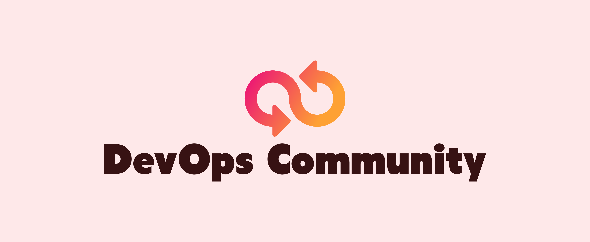

# DevOpsCommunity

The DevOps/SRE community is for those folks who are trying to learn or explore DevOps with the help of experienced professionals. Opportunities are open to sharing. 

Check out our [Website](https://devopscommunity.in) and [DevOps Community](https://twitter.com/i/communities/1523681883384549376) on twitter for more.

* This repository is completely Open-Source.
* Goal is to create DevOps awareness and share the free resource.
* Anyone who wants to contribute, Feel free to submit Pull requests.

Resources are added frequently! ⚡

Enjoy!

# Open-Source Contribution

* If you want to contribute, This repository is in build. Feel free to do it.
* Help needed for Alignment of Resources, and Readme.md creation with proper contributing guidelines.
* If you want to contribute DevOps related blogs to our DevOps Community: Feel free to do so 👉 [Blog Contributions](/blog-contributions.md)
* If you want to contribute to our [DevOps Community](http://devopscommunity.in) Website: Feel free to do so 👉 [Website Contributions](https://github.com/rohitg00/devopscommunity-website)

If you like this repo, be sure to ⭐ it.

Please read [`contributing guidelines`](https://github.com/rohitg00/DevOpsCommunity/blob/main/contributing.md) before submitting new Resources.

--- 

Initially created by [Rohit Ghumare](https://github.com/rohitg00/) on [Twitter](https://twitter.com/ghumare64).

---
# Active Discounts - apply asap!
## CNCF is celebrating Open Source Software Month! 💛

### Use the coupon "FEB25BUNGOLDEN" to enjoy up to 75% off on bundles!

#### 50% off bundles:
- 👉 KCNA + KCSA: https://lnkd.in/ea3k99pF
- 👉 CKA + CKAD: https://lnkd.in/eS3cVvcA
- 👉 KUBESTRONAUT: https://lnkd.in/ev9cEEyP
- 👉 LFCS + KCNA: https://lnkd.in/eP6UbeBE
- 👉 CKA + CKAD + CKS: https://lnkd.in/ejaArWDR
- 👉 CKA + CKS: https://lnkd.in/eU27AZNA
- 👉 KCSA + CKS: https://lnkd.in/eJTiTpAy
- 👉 KCNA + CKA: https://lnkd.in/e5ekRR_k

#### 75% off super bundles:
- 👉 Cloud Native Super Bundle: https://lnkd.in/eVfFM55w
- 👉 Cybersecurity Super Bundle: https://lnkd.in/eMnHfap8

# "Valid till the 25th of Feb!"

* Add here

# DevOps Resources
Name | Resource Link | Information
------ | ------- | --------------
DevOps Roadmap | https://medium.com/@ghumare64/devops-roadmap-2025-352da3d08251 | DevOps Roadmap 2025
DevOps Path | https://twitter.com/ghumare64/status/1537460982582128641?s=20&t=KA45jQ2CBsyZK3wFW9zi7g | Recommended by me, If focusing on the Job Interview
DevOps Roadmap by the roadmap.sh | https://roadmap.sh/devops | A community-driven step-by-step guide for DevOps, SRE, or any other Operations Role in 2022
Kubernetes Resources | https://twitter.com/ghumare64/status/1586751198962495489?s=20&t=oeBFJCpW8z_ZEpe1F65W8A | Tweet thread
Remote Job Path | https://twitter.com/ghumare64/status/1567096152079859712?s=20&t=bTOHCdrD6epup8J2p7Fucw | It is my experience while applying for remote jobs
DevOps Books | https://github.com/rohitg00/DevOps_Books | Repository created to host every free DevOps book available
Resume Tips | https://twitter.com/ghumare64/status/1529346650468012032?s=20&t=KA45jQ2CBsyZK3wFW9zi7g | This tweet contains - Resume tips and my latex  resume template
DevOps Youtube Channels | https://twitter.com/ghumare64/status/1559771038895853568?s=20&t=KA45jQ2CBsyZK3wFW9zi7g | This tweet contains - Youtube video channels to learn DevOps free of cost.
DevOps Tools | https://twitter.com/ghumare64/status/1560892185842941953?s=20&t=mTInaYg86KZbVNyC865ntQ | I personally use these DevOps tools
System Design Resources | https://twitter.com/ghumare64/status/1530525871366230017?s=20&t=KA45jQ2CBsyZK3wFW9zi7g | This tweet contains - Resources to learn System Design. 🤖 System Design is an essential part of SDE/SRE Interviews.
DevOps Projects - 1 | https://twitter.com/ghumare64/status/1523372831513673729?s=20&t=luieHHpWhSqkW3_Pg3VWnQ | 5 DevOps Projects that will get you a job
DevOps Projects - 2 | https://twitter.com/ghumare64/status/1546127603282710530?s=20&t=luieHHpWhSqkW3_Pg3VWnQ | "Anna Afamefuna, Thanks for curation"
DevOps Resources - 1 | https://twitter.com/ghumare64/status/1526398860389519361?s=20&t=luieHHpWhSqkW3_Pg3VWnQ | This is part 1 of some DevOps resources
DevOps Resources - 2 | https://twitter.com/ghumare64/status/1528377875044663296?s=20&t=luieHHpWhSqkW3_Pg3VWnQ | This is part 2 of some DevOps resources
DevOps Resources - 3 | https://twitter.com/ghumare64/status/1531885835150233600?s=20&t=luieHHpWhSqkW3_Pg3VWnQ | This is part 3 of some DevOps resources
Free Courses | https://twitter.com/ghumare64/status/1581497472043536385?s=20&t=k_1DZf1dgt6iU4IGIWx9zA | DevOps, Data Science, and Python Free Courses
AWS Resources | [AWS Badges](https://aws.amazon.com/training/badges/) | Learn AWS skills and earn AWS digital badges for FREE!
Tricks to earn through DevOps | https://twitter.com/ghumare64/status/1555793156847063040?s=20&t=KA45jQ2CBsyZK3wFW9zi7g | This tweet contains - Tips and tricks to earn more than 50$/hr+ with DevOps and powerful content.
Part-time Jobs | https://twitter.com/ghumare64/status/1530242128139259905?s=20&t=KA45jQ2CBsyZK3wFW9zi7g | Learn about part-time jobs in DevOps
Service Mesh | https://twitter.com/ghumare64/status/1547812558295670784?s=20&t=KA45jQ2CBsyZK3wFW9zi7g | Different resources to learn service mesh free of cost
Getting Started With eBPF | https://ebpf.io/what-is-ebpf/ | eBPF (which is no longer an acronym for anything) is a revolutionary technology with origins in the Linux kernel that can run sandboxed programs in a privileged context such as the operating system kernel.
Free Introduction to GitOps | https://bit.ly/3xKPZyi |  Linux Foundation course
DevOps-The-Hard-Way-AWS | https://buff.ly/3QxT6QE | This repository contains free labs for setting up an entire workflow and DevOps environment from a real-world perspective in AWS
DevOps Exercises | https://github.com/bregman-arie/devops-exercises | Linux, Jenkins, AWS, SRE, Prometheus, Docker, Python, Ansible, Git, Kubernetes, Terraform, OpenStack, SQL, NoSQL, Azure, GCP, DNS, Elastic, Network, Virtualization. DevOps Interview Questions
90DaysOfDevOps | https://github.com/MichaelCade/90DaysOfDevOps | This repository is my documenting repository for learning the world of DevOps. I started this journey on the 1st of January 2022 and I plan to run to March 31st for a complete 90-day romp on spending an hour a day including weekends to get foundational knowledge across a lot of different areas that make up DevOps.
Learn DevOps | https://github.com/dwyl/learn-devops | 🚧 Learn the craft of "DevOps" (Developer Operations) to Deploy your App and Monitor it so it stays "Up"!
Awesome Learning | https://github.com/Lets-DevOps/awesome-learning | A curated list of DevOps learning resources. Join the slack channel to discuss more.
DevOps Academy | https://github.com/devopsacademyau/academy | DevOps content, classes, and exercises
DevOps Gitbook | https://tkssharma-devops.gitbook.io/devops-training/ | Some curated DevOps insights 
📄 Github Gists | [1](https://t.co/gpWbgCKdrY) [2](https://t.co/jdQJtSYUjL) [3](https://t.co/OyObbwSbwf) [4](https://t.co/dDxC2TU0JW) [5](https://t.co/AvuBAnXzqK) [6](https://t.co/AvuBAnXzqK) [7](https://t.co/ThxJIAyM4U) [8](https://t.co/wyZ4Cg8lif) [9](https://t.co/2u83ClKLR8) | Application Security Interview Preparation Questions
📚 Free e-Books | https://bit.ly/3LfMOma | The Container Security Book by Liz Rice
🧑‍💻 GitHub Repos - 1 | https://bit.ly/3ypmikg | Automated Vagrant Kubernetes Cluster Setup
🧑‍💻 GitHub Repos - 2 | https://bit.ly/3dGLCfw | Kubetools - A Curated List of Kubernetes Tools
🧑‍💻 GitHub Repos - 3 | https://bit.ly/3Kejxa5 | System Design Primer
🧑‍💻 Github Repos - 4 | https://github.com/vilaca/awesome-k8s-tools | Learn awesome k8s tools
🧑‍💻 Github Repos - 5 | https://github.com/distributethe6ix/70DaysOfServiceMesh | #70DaysOfServiceMesh repo to learn service meshes for free
🧑‍💻 Github Repos - 6 | https://github.com/bregman-arie/howtheydevops | How They DevOps - a curated knowledge repository on how companies do DevOps
☸️ Kubernetes course by CIVO | https://www.civo.com/academy | Kubernetes - An orchestration tool used to manage your containers and application
Sample Docker Templates | https://github.com/devtron-labs/devtron/tree/main/sample-docker-templates  | Devtron Sample Docker Templates - If you're exploring the docker images and stuck with the creation of dockerfiles, This resource gets you covered.
DevOps Projects | https://github.com/Abhinav-26/DevOps-Projects | Curated List of DevOps Projects
DevOps Interview Questions | https://github.com/rohitg00/devops-interview-questions | One stop DevOps Interview Questions Hub
DevOps Certifications | https://twitter.com/ghumare64/status/1606092417710465024?s=20&t=IrhAbKVK28RapvQLguminw | Curated List of DevOps Free Certification
DevOps Roadmap 2022 by Kubesimplify | https://youtu.be/7l_n97Mt0ko | Ultimate guide to get into DevOps and Cloud Native
How to use Nginx | https://twitter.com/pragyanatvade/status/1610471444709883907 | Learn everything about Ngnix in a tweet
DevOps Projects | https://twitter.com/ghumare64/status/1620001389668859909?s=20&t=0d6SL6J9I4Xa1un7e7-G9g | 8 DevOps projects to add on your resume
Do's & Don't as a DevOps Engineer| https://twitter.com/pragyanatvade/status/1612644458184450048 | Learn 5 years of DevOps experience
Deployment Strategies | https://twitter.com/pragyanatvade/status/1616269657828106242 | Five Deployment Strategies You Must Know for free
The DevOps Revolution | https://twitter.com/pragyanatvade/status/1618444723126927360 | Changes that DevOps revolution has brought into all facets of an organization exercises
SSH Guide | https://twitter.com/pragyanatvade/status/1615544850912272384 | Learn Beginner's Guide to SSH
dig Cheatsheet | https://twitter.com/pragyanatvade/status/1615181182521556992 | Cheatsheet to debug DNS issues using dig for free
kubernetes Cheatsheet | https://twitter.com/pragyanatvade/status/1613008162839298048 | Learn all K8s command in single tweet
DevOps and Cloud native Newslettters | https://twitter.com/ghumare64/status/1616310250466082816?s=20&t=rD4lWRwU--gDJ6UIuVTf4g | All DevOps and Cloud native newsletter you should consider subscribing for free
5 DevOps YouTube channels | https://www.instagram.com/p/CoB9QzEt4Sy/?utm_source=ig_web_copy_link | Top 5 youtube video channels to learn DevOps on Instagram post.
🎮 DevOps Games | https://twitter.com/ghumare64/status/1621930988292149250?s=20&t=5LnvoilsgzmIQvJaBK0h0Q | Learn DevOps by playing games
Linux Resources | https://twitter.com/ghumare64/status/1688792620196360192?s=20 | Learn Linux with these 5 websites
YAML Resources | https://x.com/ghumare64/status/1704382663434318219?s=20 | 5 Websites to learn YAML for DevOps
